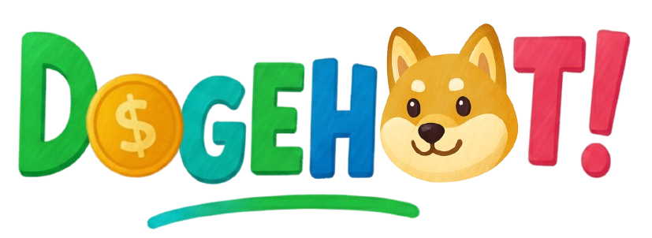

# 🐕 DogeHoot

<div align="center">



**Plataforma interactiva de cuestionarios en tiempo real al estilo Kahoot**

[](https://www.python.org/)
[](https://flask.palletsprojects.com/)
[](https://www.mysql.com/)
[](LICENSE)

[✨ Características](#-características) • [🚀 Inicio Rápido](#-inicio-rápido) • [📖 Documentación](#-documentación) • [🛠️ Tecnologías](#️-tecnologías)

</div>

---

## 📋 Tabla de Contenidos

- [Acerca del Proyecto](#-acerca-del-proyecto)
- [Características](#-características)
- [Demo](#-demo)
- [Tecnologías](#️-tecnologías)
- [Requisitos Previos](#-requisitos-previos)
- [Instalación](#-instalación)
- [Configuración](#️-configuración)
- [Uso](#-uso)
- [Estructura del Proyecto](#-estructura-del-proyecto)
- [API Reference](#-api-reference)
- [Contribuir](#-contribuir)
- [Licencia](#-licencia)
- [Contacto](#-contacto)

---

## 🎯 Acerca del Proyecto

**DogeHoot** es una plataforma educativa interactiva que permite a profesores crear cuestionarios dinámicos y organizar sesiones de juego en tiempo real con sus estudiantes. Inspirado en Kahoot, DogeHoot ofrece una experiencia gamificada con:

- 🎮 **Partidas en tiempo real** con sistema de PIN
- 👥 **Modo individual y grupal** para diferentes dinámicas de clase
- 📊 **Reportes detallados** en Excel y visualización de estadísticas
- 🏆 **Sistema de recompensas** con monedas y puntos
- 🎨 **Personalización** con skins y avatares
- 📱 **Responsive design** - funciona en cualquier dispositivo

### ¿Por qué DogeHoot?

- **Gratuito y Open Source**: Sin límites de participantes ni funciones premium
- **Fácil de usar**: Interfaz intuitiva para profesores y estudiantes
- **Flexible**: Soporta múltiples entornos de base de datos (local, TiDB Cloud, PythonAnywhere)
- **Extensible**: Arquitectura modular fácil de personalizar

---

## ✨ Características

### Para Profesores 👨‍🏫

- ✅ **Crear cuestionarios** con múltiples preguntas y opciones
- ✅ **Importar desde Excel** - carga masiva de preguntas
- ✅ **Adjuntar imágenes** a preguntas
- ✅ **Configurar tiempo** por pregunta
- ✅ **Organizar por categorías**
- ✅ **Generar PIN único** para cada sesión
- ✅ **Vista de anfitrión** con estadísticas en vivo
- ✅ **Exportar resultados** a Excel con gráficos

### Para Estudiantes 👩‍🎓

- ✅ **Unirse con PIN** sin necesidad de cuenta (modo invitado)
- ✅ **Competir en tiempo real** individual o en grupos
- ✅ **Ver ranking en vivo** durante y después del juego
- ✅ **Ganar monedas y puntos** según desempeño
- ✅ **Desbloquear skins** para personalizar perfil
- ✅ **Historial de partidas** y estadísticas personales

### Características Técnicas 🔧

- 🔐 **Autenticación JWT** para APIs seguras
- 🌐 **WebSockets** para sincronización en tiempo real
- 📧 **Sistema de emails** para verificación y restablecimiento de contraseña
- ☁️ **Integración con OneDrive/Google Drive** para almacenamiento de reportes
- 🗄️ **Soft delete** - no se pierde información
- 🔄 **Sistema de sesiones** con gestión de estado en memoria

---

## 🎬 Demo

### Flujo de Uso

1. **Profesor crea un cuestionario**
   ```
   Dashboard → Crear Cuestionario → Agregar Preguntas → Publicar
   ```

2. **Iniciar partida**
   ```
   Seleccionar Cuestionario → Configurar (Individual/Grupal) → Generar PIN
   ```

3. **Estudiantes se unen**
   ```
   Ir a /join → Ingresar PIN → Elegir nombre → Unirse
   ```

4. **Jugar en tiempo real**
   ```
   Pregunta → Responder → Ver resultados → Siguiente pregunta → Ranking final
   ```

5. **Ver reportes**
   ```
   Mis Partidas → Ver Detalles → Descargar Excel
   ```

---

## 🛠️ Tecnologías

### Backend

| Tecnología | Versión | Uso |
|-----------|---------|-----|
| **Python** | 3.8+ | Lenguaje principal |
| **Flask** | 3.1.2 | Framework web |
| **Flask-SocketIO** | 5.5.1 | WebSockets para tiempo real |
| **Flask-JWT** | 0.3.2 | Autenticación API |
| **PyMySQL** | 1.1.2 | Conector de base de datos |
| **eventlet** | 0.40.3 | Servidor asíncrono |

### Frontend

| Tecnología | Uso |
|-----------|-----|
| **HTML5/CSS3** | Estructura y estilos |
| **JavaScript (Vanilla)** | Lógica del cliente |
| **Socket.IO Client** | Comunicación en tiempo real |
| **AJAX** | Peticiones asíncronas |

### Base de Datos

| Opción | Descripción |
|--------|-------------|
| **MySQL** | Desarrollo local |
| **TiDB Cloud** | Producción (compatible MySQL) |
| **PythonAnywhere MySQL** | Hosting gratuito |

### Librerías de Procesamiento

| Librería | Versión | Uso |
|----------|---------|-----|
| **pandas** | 2.1.4 | Análisis de datos |
| **openpyxl** | 3.1.2 | Importación/exportación Excel |
| **Pillow** | 12.0.0 | Procesamiento de imágenes |
| **XlsxWriter** | 3.1.9 | Reportes Excel avanzados |

### APIs Externas

- **Google Drive API** - Almacenamiento de reportes
- **Google Gmail API** - Envío de emails
- **Microsoft OneDrive API** - Almacenamiento alternativo
- **Microsoft Outlook API** - Envío de emails alternativo
- **SendGrid** - Servicio de email transaccional

---

## 📦 Requisitos Previos

Antes de comenzar, asegúrate de tener instalado:

- **Python 3.8 o superior**
  ```bash
  python --version
  ```

- **pip** (gestor de paquetes de Python)
  ```bash
  pip --version
  ```

- **MySQL 8.0+** (o acceso a TiDB Cloud)
  ```bash
  mysql --version
  ```

- **Git** (para clonar el repositorio)
  ```bash
  git --version
  ```

---

## 🚀 Instalación

### 1. Clonar el Repositorio

```bash
# Clonar el proyecto
git clone https://github.com/Nicols7A4/DogeHoot.git

# Entrar al directorio
cd DogeHoot
```

### 2. Crear Entorno Virtual

Es **altamente recomendado** usar un entorno virtual para evitar conflictos de dependencias:

```bash
# Crear entorno virtual
python -m venv venv

# Activar entorno virtual
# En macOS/Linux:
source venv/bin/activate

# En Windows:
venv\Scripts\activate
```

### 3. Instalar Dependencias

```bash
# Instalar todas las dependencias
pip install -r requirements.txt
```

Esto instalará automáticamente todas las librerías necesarias (Flask, PyMySQL, pandas, etc.)

### 4. Configurar Base de Datos

#### Opción A: MySQL Local

1. Crear base de datos:
```sql
CREATE DATABASE dogehoot CHARACTER SET utf8mb4 COLLATE utf8mb4_unicode_ci;
```

2. Importar esquema (si tienes un archivo SQL):
```bash
mysql -u tu_usuario -p dogehoot < schema.sql
```

#### Opción B: TiDB Cloud

1. Crear cluster gratuito en [TiDB Cloud](https://tidbcloud.com/)
2. Obtener credenciales de conexión
3. Configurar en `.env` (siguiente paso)

---

## ⚙️ Configuración

### 1. Crear Archivo de Variables de Entorno

Crea un archivo `.env` en la raíz del proyecto:

```bash
touch .env
```

### 2. Configurar Variables de Entorno

Copia y pega en `.env`, reemplazando los valores:

```env
# === ENTORNO DE BASE DE DATOS ===
# Opciones: 'local', 'tidb', 'pythonanywhere'
DB_ENVIRONMENT=local

# === CONFIGURACIÓN LOCAL ===
DB_HOST_LOCAL=localhost
DB_USER_LOCAL=root
DB_PASS_LOCAL=tu_password
DB_NAME_LOCAL=dogehoot
DB_PORT_LOCAL=3306

# === CONFIGURACIÓN TIDB CLOUD (PRODUCCIÓN) ===
DB_HOST_TIDB=gateway01.us-west-2.prod.aws.tidbcloud.com
DB_USER_TIDB=tu_usuario_tidb
DB_PASS_TIDB=tu_password_tidb
DB_NAME_TIDB=dogehoot
DB_PORT_TIDB=4000

# === FLASK ===
FLASK_APP=mysite/main.py
FLASK_ENV=development
SECRET_KEY=tu_clave_secreta_aqui_cambiar_en_produccion

# === EMAIL (GMAIL API - OPCIONAL) ===
GMAIL_CLIENT_ID=tu_client_id.apps.googleusercontent.com
GMAIL_CLIENT_SECRET=tu_client_secret
GMAIL_REFRESH_TOKEN=tu_refresh_token

# === ONEDRIVE API (OPCIONAL) ===
ONEDRIVE_CLIENT_ID=tu_client_id
ONEDRIVE_CLIENT_SECRET=tu_client_secret
ONEDRIVE_REFRESH_TOKEN=tu_refresh_token

# === SENDGRID (OPCIONAL) ===
SENDGRID_API_KEY=tu_sendgrid_api_key
```

### 3. Verificar Conexión

Prueba que la base de datos se conecte correctamente:

```bash
python -c "from mysite.bd import obtener_conexion; conn = obtener_conexion(); print('✅ Conexión exitosa' if conn else '❌ Error de conexión')"
```

---

## 💻 Uso

### Iniciar el Servidor

```bash
# Desde la raíz del proyecto
cd mysite
python main.py
```

O usando Flask CLI:

```bash
# Desde la raíz del proyecto
export FLASK_APP=mysite/main.py  # Linux/Mac
set FLASK_APP=mysite/main.py     # Windows
flask run --port 5001
```

El servidor estará disponible en: **http://localhost:5001**

### Crear Primera Cuenta

1. Ir a http://localhost:5001
2. Click en "Registrarse"
3. Completar formulario
4. Verificar email (revisa consola para el código de verificación si no tienes email configurado)

### Crear Primer Cuestionario

1. Iniciar sesión
2. Ir a "Dashboard" → "Crear Cuestionario"
3. Agregar título, descripción y categoría
4. Agregar preguntas con sus opciones
5. Marcar la respuesta correcta
6. Publicar

### Iniciar Primera Partida

1. Dashboard → "Mis Cuestionarios"
2. Click en "Jugar" en el cuestionario deseado
3. Configurar modalidad (Individual/Grupal)
4. Click en "Generar PIN"
5. Compartir PIN con estudiantes
6. Esperar a que se unan
7. Click en "Iniciar Juego"

---

## 📁 Estructura del Proyecto

```
DogeHoot/
├── mysite/                          # Directorio principal de la aplicación
│   ├── __init__.py
│   ├── main.py                      # Punto de entrada, configuración Flask
│   ├── flask_app.py                 # Wrapper para Flask CLI
│   ├── bd.py                        # Configuración de base de datos
│   ├── User_auth.py                 # Autenticación JWT
│   ├── routes_web.py                # Rutas de páginas web
│   ├── routes_api.py                # Endpoints de API REST
│   ├── ajax_game.py                 # Lógica del juego en tiempo real
│   ├── game_events.py               # Eventos de Socket.IO (opcional)
│   │
│   ├── controladores/               # Lógica de negocio
│   │   ├── __init__.py
│   │   ├── usuarios.py              # CRUD usuarios
│   │   ├── cuestionarios.py         # CRUD cuestionarios
│   │   ├── preguntas_opciones.py    # CRUD preguntas/opciones
│   │   ├── categorias.py            # CRUD categorías
│   │   ├── controlador_partidas.py  # Gestión de partidas
│   │   ├── controlador_recompensas.py # Sistema de puntos/monedas
│   │   ├── controlador_skins.py     # Gestión de skins
│   │   ├── foto_perfil.py           # Subida de avatares
│   │   ├── importarExcel.py         # Importación de cuestionarios
│   │   ├── email_sender.py          # Gmail API
│   │   ├── outlook_email_sender.py  # Outlook API
│   │   ├── google_drive_uploader.py # Google Drive API
│   │   └── onedrive_uploader.py     # OneDrive API
│   │
│   ├── templates/                   # Plantillas HTML
│   │   ├── layout.html              # Layout base
│   │   ├── index.html               # Login/registro
│   │   ├── dashboard.html           # Panel principal
│   │   ├── cuestionarios.html       # Listado de cuestionarios
│   │   ├── mantenimiento_cuestionario.html # Editor
│   │   ├── perfil.html              # Perfil de usuario
│   │   ├── skins.html               # Tienda de skins
│   │   ├── partida/
│   │   │   ├── nueva_partida.html   # Configuración de partida
│   │   │   ├── panel_anfitrion.html # Vista del profesor
│   │   │   ├── lobby_participante.html # Sala de espera
│   │   │   └── juego_participante.html # Vista del estudiante
│   │   └── ...
│   │
│   └── static/                      # Archivos estáticos
│       ├── css/
│       │   ├── global.css           # Estilos globales
│       │   ├── dashboard.css
│       │   ├── game.css
│       │   └── ...
│       └── img/
│           ├── logo.png
│           ├── skins/               # Imágenes de skins
│           ├── usuario/             # Avatares de usuarios
│           └── cuestionarios/       # Imágenes de preguntas
│
├── requirements.txt                 # Dependencias de Python
├── .env.example                     # Ejemplo de variables de entorno
├── .gitignore
└── README.md                        # Este archivo
```

---

## 🔌 API Reference

### Autenticación

#### Obtener Token JWT

```http
POST /auth
Content-Type: application/json

{
  "username": "usuario@example.com",
  "password": "password123"
}
```

**Respuesta:**
```json
{
  "access_token": "eyJ0eXAiOiJKV1QiLCJhbGc..."
}
```

Usar el token en las siguientes peticiones:
```http
Authorization: JWT eyJ0eXAiOiJKV1QiLCJhbGc...
```

### Endpoints Principales

#### Cuestionarios

| Método | Endpoint | Descripción |
|--------|----------|-------------|
| GET | `/api/cuestionarios` | Listar todos |
| GET | `/api/cuestionarios/:id` | Obtener uno |
| POST | `/api/cuestionarios` | Crear |
| PUT | `/api/cuestionarios` | Actualizar |
| DELETE | `/api/cuestionarios/:id` | Eliminar |

#### Preguntas

| Método | Endpoint | Descripción |
|--------|----------|-------------|
| GET | `/api/cuestionarios/:id/preguntas` | Listar preguntas |
| POST | `/api/cuestionarios/:id/preguntas` | Crear pregunta |
| PUT | `/api/preguntas/:id` | Actualizar |
| DELETE | `/api/preguntas/:id` | Eliminar |

#### Partidas (Juego)

| Método | Endpoint | Descripción |
|--------|----------|-------------|
| POST | `/api/game/host/init` | Inicializar partida |
| GET | `/api/lobby/state?pin=ABC123` | Estado del lobby |
| POST | `/api/player/join` | Unirse a partida |
| POST | `/api/game/start` | Iniciar juego |
| POST | `/api/game/answer` | Enviar respuesta |
| GET | `/api/game/current?pin=ABC123` | Pregunta actual |

Ver documentación completa en `POSTMAN_PRUEBAS.md` (si existe).

---

## 🤝 Contribuir

¡Las contribuciones son bienvenidas! Aquí te explicamos cómo:

### 1. Fork el Proyecto

Click en "Fork" en la esquina superior derecha de GitHub.

### 2. Crear una Rama

```bash
git checkout -b feature/AmazingFeature
```

### 3. Hacer Cambios

```bash
git add .
git commit -m "Add: Amazing new feature"
```

### 4. Push a la Rama

```bash
git push origin feature/AmazingFeature
```

### 5. Abrir Pull Request

Ve a GitHub y abre un Pull Request describiendo tus cambios.

### Guías de Estilo

- **Python**: Seguir PEP 8
- **SQL**: Nombres de tablas en MAYÚSCULAS
- **Git Commits**: Usar prefijos (Add, Fix, Update, Remove)
- **Comentarios**: En español para funciones principales

---

## 🐛 Reportar Bugs

¿Encontraste un bug? Ayúdanos a mejorar:

1. Ve a la pestaña "Issues" en GitHub
2. Click en "New Issue"
3. Describe el problema:
   - ¿Qué esperabas que pasara?
   - ¿Qué pasó en realidad?
   - Pasos para reproducir
   - Capturas de pantalla (si aplica)

---

## 📝 Licencia

Este proyecto está bajo la Licencia MIT. Ver archivo `LICENSE` para más detalles.

---

## 👥 Autores

- **Marco Chacón** - *Desarrollo Principal* - [@dArKaZzZ](https://github.com/dArKaZzZ)
- **Equipo DogeHoot** - *Colaboradores*

Ver la lista completa de [contribuidores](https://github.com/Nicols7A4/DogeHoot/contributors).

---

## 🙏 Agradecimientos

- Inspirado en [Kahoot!](https://kahoot.com/)
- Íconos de [Flaticon](https://www.flaticon.com/)
- Documentación basada en [Best-README-Template](https://github.com/othneildrew/Best-README-Template)

---

## 📞 Contacto

**DogeHoot Project**

- 📧 Email: marcochaconchavez09@gmail.com
- 🐙 GitHub: [@Nicols7A4](https://github.com/Nicols7A4)
- 🔗 Proyecto: [https://github.com/Nicols7A4/DogeHoot](https://github.com/Nicols7A4/DogeHoot)

---

## 🗺️ Roadmap

- [x] Sistema de autenticación completo
- [x] Creación de cuestionarios con editor visual
- [x] Partidas en tiempo real individual y grupal
- [x] Sistema de recompensas (puntos y monedas)
- [x] Reportes en Excel con estadísticas
- [x] Importación masiva desde Excel
- [ ] Modo oscuro
- [ ] Integración con Google Classroom
- [ ] App móvil nativa
- [ ] Sistema de logros y badges
- [ ] Chat en vivo durante partidas
- [ ] Preguntas con video y audio

---

## 📊 Estadísticas del Proyecto


---

<div align="center">

**⭐ Si este proyecto te fue útil, considera darle una estrella en GitHub ⭐**

**Hecho con ❤️ por el equipo DogeHoot**

[⬆ Volver arriba](#-dogehoot)

</div>
