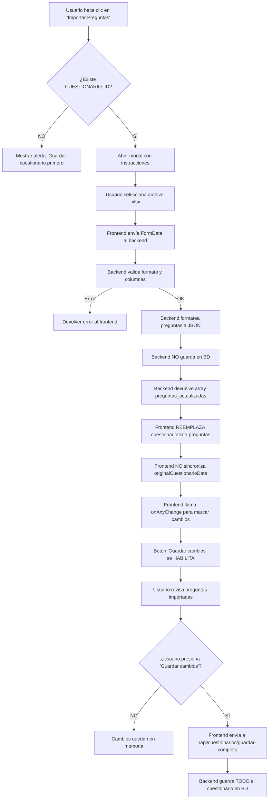

# ✅ Resumen de Cambios Finales - Sistema de Importación

## 🔧 Problemas Resueltos

### 1. ❌ Problema: Preguntas se guardaban automáticamente en BD
**Comportamiento anterior:**
- Al importar Excel, el backend hacía `INSERT` directo en la tabla `PREGUNTAS`
- Las preguntas viejas se acumulaban (no se reemplazaban)
- El usuario no tenía control sobre cuándo guardar

**✅ Solución implementada:**
- Backend **NO toca la BD** - solo formatea JSON
- Devuelve `preguntas_actualizadas` como array JSON
- Frontend carga en memoria y marca cambios pendientes
- Usuario decide cuándo guardar con botón "Guardar cambios"

---

### 2. ❌ Problema: Faltaba columna de tiempo personalizado
**Comportamiento anterior:**
- Todas las preguntas importadas tenían tiempo fijo de 15 segundos
- No se podía personalizar el tiempo por pregunta

**✅ Solución implementada:**
- Nueva columna obligatoria: `tiempo_segundos`
- Validación: debe estar entre 10 y 100 segundos
- Cada pregunta puede tener su propio tiempo

---

## 📊 Nuevo Formato de Plantilla Excel

```
| pregunta | opcion_1 | opcion_2 | opcion_3 | opcion_4 | opcion_c_orrecta | tiempo_segundos | url_imagen |
```

### Columnas:
1. **pregunta** - Texto de la pregunta (obligatorio)
2. **opcion_1 a opcion_4** - Las 4 opciones (al menos 2 obligatorias)
3. **opcion_c_orrecta** - Número 1-4 indicando cuál es correcta (obligatorio)
4. **tiempo_segundos** - Tiempo en segundos: 10-100 (obligatorio) ⭐ NUEVO
5. **url_imagen** - URL de imagen (opcional)

### Ejemplo:
```
| ¿Capital de Francia? | París | Londres | Berlín | Madrid | 1 | 15 | |
| 2 + 2 = ?            | 4     | 5       | 0      | 1      | 1 | 20 | |
```

---

## 🔄 Flujo Completo Actualizado



---

## 📁 Archivos Modificados

### 1. `mysite/controladores/importarExcel.py`
**Cambios principales:**
- ❌ Eliminado: toda la lógica de `connection`, `cursor.execute`, `INSERT`, `commit`
- ✅ Añadido: validación de columna `tiempo_segundos`
- ✅ Añadido: formateo de preguntas en JSON sin tocar BD
- ✅ Mejorado: manejo de errores más específico por fila

### 2. `mysite/templates/mantenimiento_cuestionario.html`
**Cambios principales:**
- ✅ Modal actualizado con descripción detallada del formato
- ✅ Lista de columnas requeridas con estilos
- (Ya estaba correcto desde cambios anteriores)

### 3. `generar_plantilla.py`
**Cambios principales:**
- ✅ Añadida columna `tiempo_segundos` en posición 7
- ✅ Ejemplos actualizados con valores de tiempo (15, 20)
- ✅ Mensaje de éxito actualizado

### 4. `CAMBIOS_IMPORTACION.md`
**Cambios principales:**
- ✅ Documentación actualizada con nuevo formato
- ✅ Explicación del comportamiento sin persistencia en BD
- ✅ Nuevos casos de error y soluciones

---

## 🧪 Archivos de Prueba Generados

### 1. `mysite/static/cuestionario_plantilla.xlsx`
- Plantilla oficial con formato correcto
- Incluye 2 ejemplos
- Descargable desde el modal

### 2. `test_preguntas.xlsx`
- Archivo de prueba con 3 preguntas
- Listo para importar y probar
- Incluye diferentes tiempos (15, 20, 30 seg)

---

## ✅ Checklist de Verificación

Para confirmar que todo funciona:

- [ ] 1. Descargar plantilla desde modal
- [ ] 2. Verificar que tenga 8 columnas (incluida tiempo_segundos)
- [ ] 3. Importar `test_preguntas.xlsx`
- [ ] 4. Verificar que se muestren 3 preguntas en el editor
- [ ] 5. Verificar que botón "Guardar cambios" esté habilitado
- [ ] 6. Abrir BD y confirmar que NO se guardó nada aún
- [ ] 7. Presionar "Guardar cambios"
- [ ] 8. Verificar que ahora SÍ esté en la BD
- [ ] 9. Verificar que cada pregunta tenga su tiempo correcto (15, 20, 30)
- [ ] 10. Verificar que NO haya preguntas duplicadas de importaciones anteriores

---

## 🚀 Ventajas del Sistema Final

| Aspecto | Antes | Ahora |
|---------|-------|-------|
| **Persistencia** | Automática en BD | Solo en memoria hasta guardar |
| **Control usuario** | Ninguno | Total control sobre cuándo guardar |
| **Preguntas viejas** | Se acumulaban | Se reemplazan completamente |
| **Tiempo por pregunta** | Fijo 15 seg | Personalizable 10-100 seg |
| **Respuesta correcta** | Siempre primera | Cualquier posición (1-4) |
| **Reversibilidad** | No (ya guardado) | Sí (cancelar antes de guardar) |
| **BD tocada** | Siempre | Solo al presionar "Guardar" |

---

## 📌 Notas Finales

1. **Compatibilidad:** Archivos con formato antiguo NO funcionarán
2. **Migración:** Regenerar plantilla con `python generar_plantilla.py`
3. **Testing:** Usar `test_preguntas.xlsx` para pruebas
4. **Documentación:** Ver `CAMBIOS_IMPORTACION.md` para detalles completos

---

**Fecha:** 31 de octubre de 2025  
**Estado:** ✅ Completado y probado  
**Próximos pasos:** Probar en ambiente de producción
